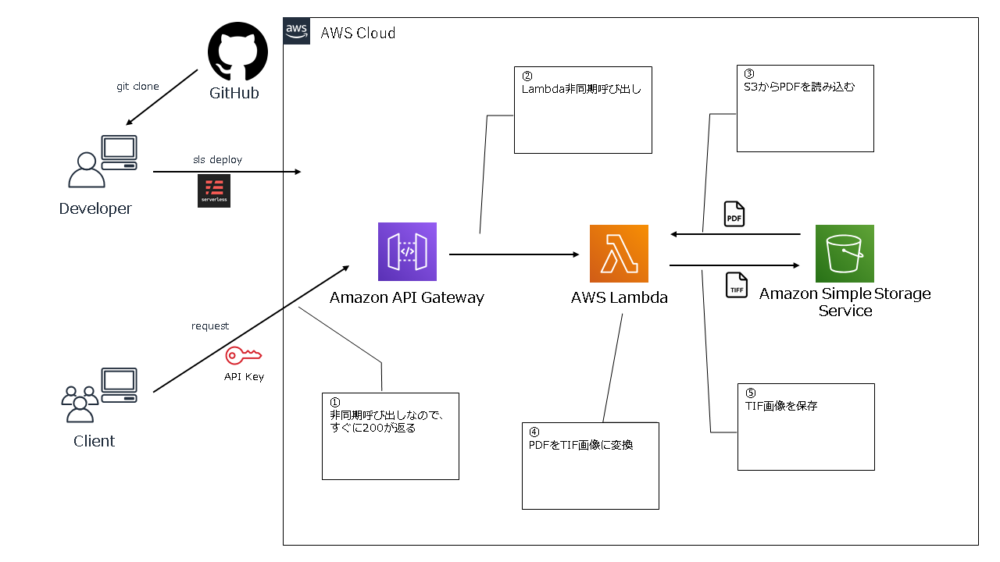

# PDF to TIFF API

PDF画像を(白黒=モノクロ2階調)TIFFへ変換するAPI
- 解像度：400 dpi
- ファイル形式：マルチページTIFF
- カラー：モノクロ2階調
- 圧縮形式：CCITT Group 4

Dependency
* [pdf2image](https://github.com/Belval/pdf2image)
* [serverless framework](https://serverless.com/)

## デプロイ



1. 事前準備
    - [Git](https://git-scm.com/downloads)のインストール
        - 本リポジトリのコードを取得・更新するために使用する。
        - 改行コードをCRLFに変換しないように、コード取得前に下記のコマンドを実行する。
            ```bash
            git config --global core.autocrlf input
            ```
    - [Python](https://www.python.jp/install/windows/install_py3.html)のインストール
        - Lambdaのランタイムと同じPython3.8をインストール
    - [nodejs/npm](https://nodejs.org/ja/download/)のインストール
        - Node.jsの最新版をインストール
    - [AWS CLI](https://docs.aws.amazon.com/ja_jp/cli/latest/userguide/cli-chap-install.html)のインストール
        - Pythonインストール後に下記のコマンドでインストール可能
            ```bash
            pip install awscli
            ```
        - 下記のコマンドでcredentialの設定を行う
            ```bash
            aws configure
            ```
            入力例
            ```txt
            AWS Access Key ID [None]: AWSのアクセスキー
            AWS Secret Access Key [None]: AWSのシークレットアクセスキー
            Default region name [None]: ap-northeast-1
            Default output format [None]: json
            ```
    - [Serverless Framework](https://www.serverless.com/framework/docs/providers/aws/guide/installation/)のインストール
        - 下記のnpmコマンドでインストール
            ```bash
            npm install -g serverless
            ```
        - プロキシ環境で上記コマンドでエラーが発生した場合は下記コマンドでプロキシ設定を行いリトライする。
            ```bash
            npm config set proxy プロキシアドレス
            npm config set https-proxy プロキシアドレス
            npm config set registry http://registry.npmjs.org/
            ```
    - [Docker](https://docs.docker.com/get-docker/)のインストール
        - パッケージングに使用する
        - プロキシ環境下で動作させるには以下の設定を行う。
            - `Settings` > `Resources` > `Proxies`から設定を行う。
            - `~/.docker/config.json`（Windowsの場合、`C:\Users\ユーザー名\.docker\config.json`）に以下の`proxies`キーを追加する。
                ```json
                "proxies": {
                    "default": {
                        "httpProxy": "プロキシアドレス",
                        "httpsProxy": "プロキシアドレス"
                    }
                }
                ```
    - S3にデプロイ用のバケットの作成
      - バケット名：`ステージ名-pdf-to-tiff-deployment`<br>
        例）`hogehoge-pdf-to-tiff-deployment`<br>
            -> 作成されるリソースが全て`hogehoge-*`になる

2. デプロイパッケージの作成
    - Dockerイメージをビルド
        ```bash
        docker build -t pdf-to-tiff .
        ```
    - Dockerイメージ起動
        - GitBash
            ```bash
            docker run --rm -it -v /`pwd`:/work pdf-to-tiff
            ```
        - コマンドプロンプト
            ```bash
            docker run --rm -it -v %cd%:/work pdf-to-tiff
            ```
        - PowerShell
            ```bash
            docker run --rm -it -v ${pwd}:/work pdf-to-tiff
            ```

3. 変換に使用するS3の定義
    - バケット名の決定
        1. `config.yml`の作成
            ```bash
            cp config/config.sample.yml config.yml 
            ```
        2. `config.yml`の編集（エディタで直接書き込む）
            ```bash
            S3_BUCKET_NAME: 使用するS3バケット名を入力してください
            ```
    - バケットが既存でなく、新規に作成する場合は`serverless.yml`の134行目以降のコメントを解除する

4. デプロイ
    ```bash
    sls deploy -v --stage ステージ名
    ```

5. 動作確認<br>
    LambdaコンソールのAPI GatewayトリガーからエンドポイントとAPIキーを下記のコマンドに記入して実行する。

    入力のPDFファイルはS3（3で定義したバケット）に配置しておき、下記のコマンドにキーを記入する。
    ```bash
    curl -X POST -H 'Content-Type: application/json' -H 'x-api-key: APIキー' -d '{"key": "PDFのキー"}' エンドポイント
    ```
    変換したTIF画像が同じS3の`tif/{PDFのキー}.tif`として保存される。

## 仕様

### 設計

#### リクエストヘッダー

| キー | 項目名 | 必須 | 属性 |
| --- | --- | --- | --- |
| x-api-key | APIキー | 必須 | 半角英数字 |
| Content-Type | MIMEタイプ | 必須 | 半角英字 |

※`Content-Type`は`application/json`とすること

#### リクエストボディ

| キー | 項目名 | 必須 | 属性 |
| --- | --- | --- | --- |
| key | S3のPDFファイルへのキー | 必須 | 半角英数字 |

#### レスポンスヘッダー

| キー | 項目名 | 属性 |
| --- | --- | --- |
| Content-Type | MIMEタイプ | 半角英字 |

#### レスポンスボディ

| キー | 項目名 | 属性 |
| --- | --- | --- |
| message | メッセージ | 半角英数字 |

#### ステータスコード

| コード | ステータス |
| --- | --- |
| 200 | 成功 |
| 400 | 無効なリクエスト |

※非同期なので、リクエストに成功するとすぐに200が返る<br>
※`body`に`key`が含まれていない場合とAPIキーが不正な場合は400が返る

### AWS Lambdaのエラーについて
AWS Lambdaの処理でエラーが発生した場合はCloudWatch Logs(`/aws/lambda/ステージ名-pdf-to-tiff-converter`)にエラーログが出力される。

#### エラーが発生するケース
1. S3にPDFがない or S3からPDFの取得ができない
    - エラーログ
        ```
        [ERROR] module.s3_controller download: Failed to download S3://ステージ名-pdf-to-tiff-bucket/PDFのキー.
        ```
2. 同名のtif画像が存在する
    - エラーログ
        ```
        [ERROR] module.s3_controller error_if_object_exists: Object already exists S3://ステージ名-pdf-to-tiff-bucket/tif/PDFのキー.tif.
        ```
3. 変換失敗
    - エラーログ
        ```
        [ERROR] module.convert convert: Failed convert PDFのキー to tiff
        ```
4. 画像の保存失敗
    - エラーログ
        ```
        [ERROR] module.s3_controller upload: Failed to upload S3://ステージ名-pdf-to-tiff-bucket/tif/PDFのキー.tif.
        ```