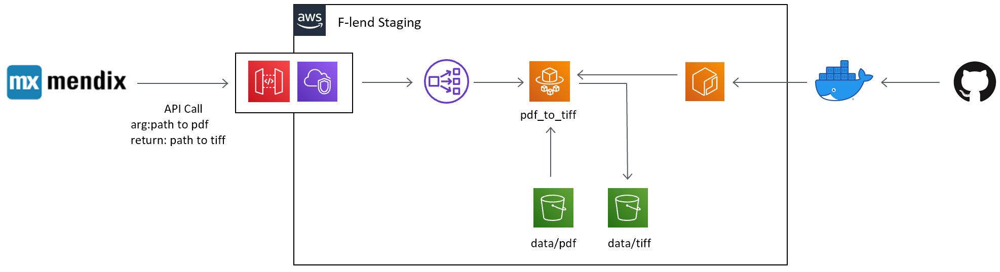

# PDF to TIFF

PDF画像を(白黒=grayscaleの)TIFFへ変換するサンプルです。

Dependency

* [pdf2image](https://github.com/Belval/pdf2image)

## How to run

### Fargate Style


※現在は上記の仕様を満たしていません。

1. Dockerを利用できる環境を用意する。

2. 以下のコマンドを実行してAWS Lambdaにデプロイするパッケージを作成する。
    ```
    cd development
    docker build -t pdf-to-tiff-for-fargate -f Dockerfile.fargate .
    ```

3. 以下のコマンドを順番に実行してローカルで動作確認を行う
    1. dockerコンテナを起動
        ```
        docker run --rm -it -p 8000:80 pdf-to-tiff-for-fargate
        ```

    2. dockerコンテナのAPIサーバーにリクエスト
        ```
        curl -X POST --noproxy localhost -F 'Filename=./data/tis_200206.pdf' -F 'file=@./data/tis_200206.pdf' http://localhost:8000 | jq -r '.file' | base64 -di > ./test.tif
        ```
        ※jqコマンドを使用できるようにしておく必要がある。
        ※pdfがtiffに変換されて`test.tif`として返却される。
        <details><summary>python requests</summary><div>

        ```python:python requests
        import os
        import requests
        import base64

        os.environ['NO_PROXY'] = 'localhost'
        filename = "tis_200206"

        with open(f"./data/{filename}.pdf", "rb") as f:
            pdf = f.read()
        files = {'file': (filename, pdf)}
        r = requests.post("http://localhost:8000", files=files)
        data = base64.b64decode(r.json()["file"])

        with open(f"./test.tif", "wb") as f:
            f.write(data)

        ```
        </div></details>

4. dockerイメージをECRにpushする...
    以降は未検証

#### Development

VSCodeの[Remote Containers](https://code.visualstudio.com/docs/remote/containers)機能を使用しています。

* [Getting started](https://code.visualstudio.com/docs/remote/containers#_getting-started)の通りにセットアップ
* F1ボタンを押して[Remote-Containers: Add Development Container Configuration~](https://code.visualstudio.com/docs/remote/containers#_quick-start-open-an-existing-folder-in-a-container)を選択。`Dockerfile.dev`を選択してconfigurationを作成。
  * 初回はコンテナの作成に時間がかかる
* Terminalを開くと、コンテナ内で開ける。

以下のコマンドで変換結果を確認可能。

```
python convert.py data/tis_200206.pdf
```
